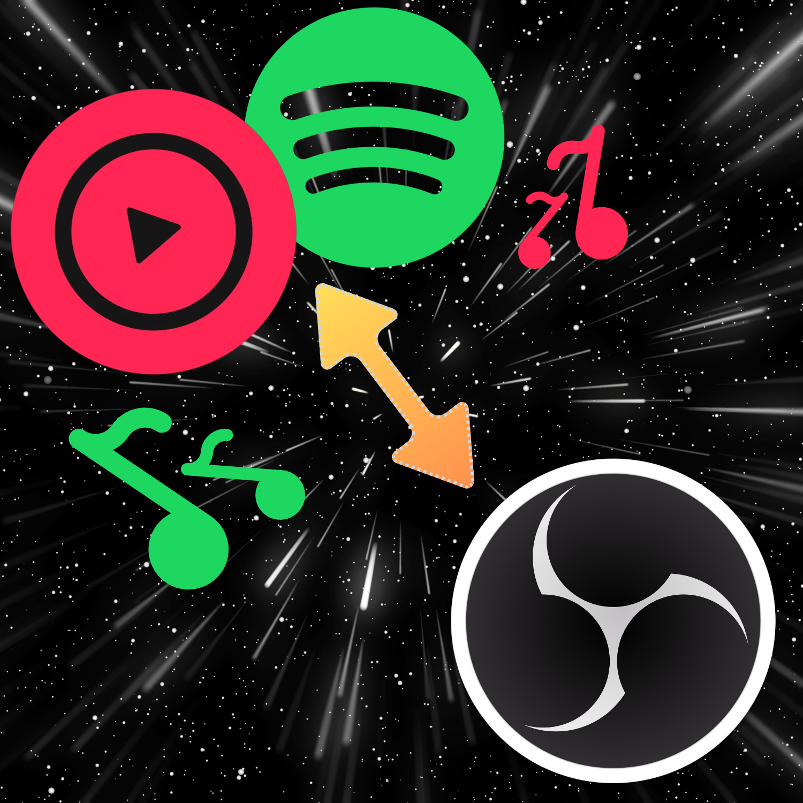
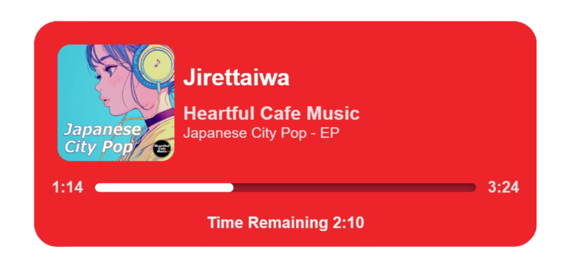

  

  <h1>🎶 OBS Music Player ⭐</h1>

  
  <h3>Easiest way to connect your favorite Music Platform to OBS! 💫</h3>
  

   
    
    
<strong>Cider Music Player</strong>

  

   
  
 
  

  
## 🚨:  Spotify is temporarily **unavailable** | **ONLY** works with **Cider App**

## 🙌🏼 What You'll Need:
- [**An Apple Music Subscription**](https://music.apple.com/us/subscribe) 🍎  
- [**OBS**](https://obsproject.com/) 🔴  
- [**The Cider Music Player** ***(Version 2.6.1.0 or Higher)***](https://cider.sh/downloads/client) 🎧  
**sidenote:** ***The App itself costs $3.49, BUT it's extremely WORTH IT!***

 

## 🤔 What's Next?

### For Cider:
- If you haven't set up **Cider App** yet, please do so and open the **Settings**. Navigate to **Connectivity**, then scroll down to the bottom. Enable the **WebSockets API** toggle. While this feature is no longer strictly required, it's recommended to keep it enabled for optimal functionality.  

- To add the **Music Player** to OBS, create a new **Browser Source** and set the **URL** to:  
  🔗 [https://officialmusto.github.io/obs-music-player/](https://officialmusto.github.io/obs-music-player/)  

- By default, the **Browser Source** will spawn with a width of **800 pixels** and a height of **600 pixels**. This size is the ideal size for the player. You may change size if you do so wish.

- The **Browser Source** in OBS will now **automatically attempt to connect to Cider every five seconds** and will **reestablish the connection if needed**, ensuring continuous functionality.  
 

### For Spotify:
- **Coming soon!** 💫

 

## 🔮 Future Updates:
- **Integration for Spotify support!** 🟢
- **Integration for YouTube Music** 🎵🎧
- **Customization options for color** 🔴🟡🔵

---

### **📝 Credits**
Originally based on work by **[@ryzetech](https://github.com/ryzetech)**.

---

## 💖 THANK YOU TO THOSE WHO DECIDE TO USE THIS APP!
